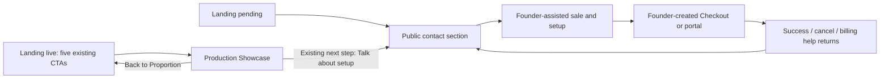

# Public funnel glue V1 — pre-D2 integration

Landing authority: `v2/visual-convergence` at
`9ec838f662ce251e5efc559a27c9f4c5328e4226`. This integration adds navigation,
public return surfaces and local qualification. It does not change the sample
conversation, AI disclosure, booking behavior or channel behavior.

## One release contract

`site.config.json` remains the authority for the public site, Showcase state and
founder contact. `tools/funnel-config.mjs` derives the public-only contract below;
`tools/export-funnel.mjs` exports it. Do not hand-maintain a second set of URLs.

| Contract field | Expected deployed value |
|---|---|
| `publicSiteUrl` | `https://proportion.systems/` |
| `showcaseUrl` | `https://demo.proportion.systems/` |
| `contactUrl` | `https://proportion.systems/#contact` |
| `billingReturnUrls.success` | `https://proportion.systems/billing-success.html` |
| `billingReturnUrls.cancel` | `https://proportion.systems/billing-cancel.html` |
| `billingReturnUrls.portal` | `https://proportion.systems/billing-return.html` |

The public site must be an explicit public HTTPS origin with a trailing slash.
Contact and return paths move together when that origin changes. Showcase must
remain the exact production URL above, including in pending configuration.
Neither a founder preview nor a local/private address is a supported destination.

```sh
SITE_CONFIG=/path/to/release-site.json npm run build
SITE_CONFIG=/path/to/release-site.json npm run check
SITE_CONFIG=/path/to/release-site.json node tools/export-funnel.mjs --release > /path/to/public-funnel.json
```

Keep the exported file with the approved release artifact, outside `dist/`.
Give the **same file** to Showcase through `AFO_PUBLIC_FUNNEL_CONFIG`. Populate
Stripe's existing success/cancel/portal-return inputs from its three fields;
the Billing integration documentation records that mapping.

`--release` requires at least one valid configured founder contact. The checked-in
configuration has no founder contact and remains a preview configuration. Booking
configuration cannot be a Stripe payment destination or a public payment route.
Founder contact details appear only on Landing; Showcase uses the public contact
section. No personal details are duplicated in Showcase configuration.

## Navigation and release gates



Pending renders zero public Showcase links. Live renders the same five existing
links to the canonical production Showcase; this integration adds no Landing CTA.
Leave `showcase.state` and `showcase.phoneLine` pending until the existing Showcase
operator, provider, edge and founder acceptance gates are satisfied. This campaign
does not change those gates or deploy any surface.

## Static billing returns

The three root-level `.html` pages work with the existing static release model and
require no SPA rewrite, API, Stripe key or client library. They reuse Landing's
fonts, navigation, spacing and button hierarchy. `return.css` is loaded only on
returns, leaving homepage CSS unchanged. All shipped scripts are self-contained,
so the existing release asset fingerprinting can rewrite their HTML references.

Success explains the completed checkout/trial enrollment step conditionally on
arriving from the founder's Checkout, then explains founder-assisted onboarding.
It explicitly states that the page does not confirm billing or activate AFO.
Cancel confirms no purchase or trial enrollment. Portal return offers billing and
setup help without claiming an account screen or a successful billing change.

Return pages do not read or interpolate query payloads. Their small script removes
query/fragment from history when available. All returns use `no-referrer` and
`noindex,nofollow`, and link to the same contact destination. Visiting a return
cannot mutate billing or activate a client; existing verified webhooks/readback
remain billing truth.

## Privacy-safe attribution

Both surfaces carry attribution only for the exact public campaign
`utm_campaign=public-funnel-v1`. `utm_source` is limited to `landing`, `showcase`
or `founder-outreach`; invalid or duplicate values become the current surface's
fixed label. `utm_medium` is always `referral`. Every other incoming parameter is
discarded when building the outgoing destination. No email, phone, customer data,
internal/session/Stripe ID or arbitrary campaign value can pass through this seam.
There is no storage, third-party analytics or extra network request. The test
runner checks that both small attribution modules are byte-identical.

## Qualification

```sh
npm test
npm run check
npm run a11y
npm run stage
npm run perf
SHOWCASE_STATE=live npm run check
SHOWCASE_STATE=live npm run a11y
SHOWCASE_STATE=live npm run stage
SHOWCASE_STATE=live npm run perf
BILLING_REPO=/path/to/billing-integration npm run test:billing-returns
SHOWCASE_REPO=/path/to/showcase-integration BILLING_REPO=/path/to/billing-integration FUNNEL_EVIDENCE_DIR=/path/to/handoff npm run test:funnel
```

Cross-repo qualification uses Node 22.18 or later, matching the existing Billing
and Showcase TypeScript source runners. The billing-return check exercises the
real service with its offline adapter and verifies all three URL bindings without
opening a server. The cross-repo browser runner qualifies A–H through real local fixture services,
Playwright, axe and the existing fake Stripe adapter. It routes only the canonical
site/demo browser origins to local fixtures and rejects all other browser traffic.
No live provider, charge, SMS or call is made. It uses a synthetic founder email in
a temporary build configuration, captures desktop/mobile changed surfaces, audits
the new return surfaces and contact step, checks responsive Showcase navigation,
and restores the safe pending build. Test/build jobs that write `dist/` must run
sequentially; performance qualification must run without competing test workloads.

`tools/public-payment-check.mjs` scans generated public bytes for payment provider
destinations, public payment routes/actions/CTA labels, and live/test Stripe keys.
The scanner reports file names and finding classes, never detected key values.
Negative controls prove that deliberately inserted payment entries are rejected.

## Deferred Product work

Existing Landing copy at `src/index.html` contains claims that AFO proactively
says it is an AI assistant (around lines 285, 360–361 and 498). Those statements,
all sample conversation strings and D2-owned sources remain unchanged. Reconcile
them only after D2 supplies the final Product meaning.

Public Checkout remains closed. No unused checkout seam was implemented. Any
future public purchase flow needs a separate Product decision and reviewed work.
`AUTO_CLIENT_ACTIVATION=NO` remains unchanged.
